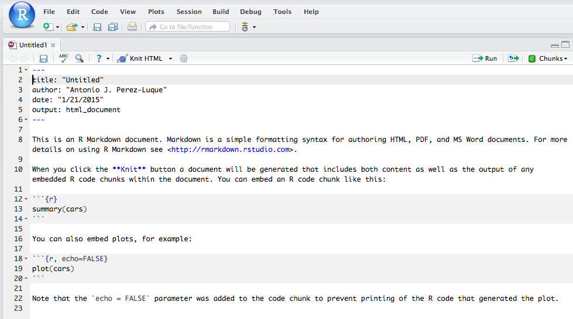

<!-- Center image on slide -->
<script src="http://ajax.aspnetcdn.com/ajax/jQuery/jquery-1.7.min.js"></script>
<script type='text/javascript'>
$(function() {
    $("p:has(img)").addClass('centered');
});
</script>


<style>
em {
  font-style: italic
}
strong {
  font-weight: bold;
}
</style>

<!-- Limit image width and height -->
<style type='text/css'>
img {
    max-height: 560px;
    max-width: 964px;
}
</style>

--- .nobackground .quote 
`(RAE)` 
<q>__Ciencia__: Conjunto de conocimientos obtenidos mediante la observación y el razonamiento, sistemáticamente estructurados y de los que se deducen principios y leyes generales</q>

--- .smaller .quote
<q>La ciencia es el conocimiento obtenido mediante la observación de patrones regulares, de razonamientos y de experimentación en ámbitos específicos, a partir de los cuales se generan preguntas, se construyen hipótesis, se deducen principios y se elaboran leyes generales y sistemas organizados por medio de un __método científico__</q>

---


--- 
# Crisis de Reproducibilidad


--- &twocol
# Fraude científico
<br>
*** =left
<p align="center"></p>

*** =right
<p align="center"></p>

--- &twocol
# Retracción
*** =left
<br>
<p align="center"></p>

*** =right
<p align="center"></p>


--- .quote .smaller
<p align="center"></p>


> * La investigación no son sólo los resultados que se publican, sino que es el conjunto de programas, código, y datos utilizados para producir los resultados (Gandrud 2014)


--- 
# Meta-analysis on the effects of temperature on plant phenology


[Wolkovich et al. 2012](https://dx.doi.org/10.1111/j.1365-2486.2012.02693.x)


--- .quote
<br>
<br>
<br>
<q align=right>¿Qué entendemos por <br>__Reproducible Science__? </q>


--- .quote 
<br>
<br>
<q> Research results are __replicable__ if there is sufficient information available for independent researchers to make the same findings using the same procedures </q>  

--- .smaller
<br>
<br>
<br>
 

[Peng 2011](https://dx.doi.org/10.1126/science.1213847)

--- .quote
<br>
<br>
<br>
<q align=right>¿Porqué ha de ser <br>__reproducible__<br> la investigación? </q>

--- 
## Por la _ciencia_ 
* __Estándar__
  * Los resultados de una investigación no pueden considerarse "contribuciones genuinas" al conocimiento humano hasta que no sean verificadas ([Stodden 2009](http://dx.doi.org/10.1109/MCSE.2009.19)).
  * Demarcación entre ciencia y no-ciencia


 


--- 
## Por la _ciencia_ 
* __Evitar duplicación de esfuerzos__
  * Disminuir la cantidad de tiempo empleado para colectar datos, manipular datos, etc.
  * Ayuda a avanzar en la generación de nuevo conocimiento ([Wolkovich et al. 2012](https://dx.doi.org/10.1111/j.1365-2486.2012.02693.x))

<p align="center"></p>

---  
## Por los _investigadores_  (por ti)

> * __Mejorar Habitos de trabajo__
  * Aumentar la facilidad para detectar errores (documentar código)
  * Accesibilidad de los pasos llevados a cabo (re-usabilidad)
  * Efectividad (evitar duplicidad de esfuerzo)
> * __Mejorar Trabajo en equipo__
  * Implementar la reproducibilidad de un proyecto facilita a tus colaboradores (presentes o futuros) ejecutar parte del mismo
 
> * __Facilitar los cambios__
   * Reproducir tus resultados en el futuro próximo (re-análisis, cambios en figuras, etc.)
> * __Mayor impacto de nuesta investigación__
  * La investigación que es reproducible contiene mas información (código, acceso a los datos, etc) y por tanto, mas razones para ser usada (y citada, i.e. [Piwowar et al. 2007](http://dx.doi.org/10.1371/journal.pone.0000308))
  

--- .smaller
__Aplicar técnicas de reproducibilidad (o al menos los principios) puede hacer que tu investigación sea mas efectiva y mas fácil__
<br>
<br>


--- .quote
<br>
<br>
<br>
<q align=right>¿Cómo hacer que nuestra investigación <br> sea mas __reproducible__? </q>

--- 
## Flujo de Trabajo Científico 
# The old-(_traditional_) way


---
## Comunicamos los resultados 

> - ¿Qué análisis has llevado a cabo para generar una figura? ¿Cómo has llevado a cabo el análisis de las medias? ¿Has tenido en cuenta la correlación entre las variables? ... 

<br>  
> - ¿Qué datos has utilizado? ¿Has llevado a cabo un filtro previo de los datos? ¿de qué tipo? ¿Has utilizado valores brutos o valores agregados? ...

<br>  
> - ¿Has probado a llevar a cabo el análisis utilizando la media armónica en vez de la media aritmética? ¿Qué resultados obtendríamos si agregamos los valores por meses en vez de por estaciones? ... 

<br>  
> - ¿Podrías incluir en la figura además unas barras de error? ¿Podrías incluir en la tabla los I.C. al 99% en vez de al 95%? 

--- .quote
Este flujo de trabajo está __roto__ 

<br>

<p align="center"></p>


--- .quote
## Consejos prácticos 
<br>
__1. Document everything!<br><br>__
__2. Everything is a (text) file<br><br>__
__3. All files should be human readable<br><br>__ 
__4. Explicity tie your files together<br><br>__
__5. Have a plan to organize, store, and make our files available__

--- 
## The big picture 


--- 
### Algunas reglas sencillas ([Sandve et al. 2013](https://dx.doi.org/10.1371/journal.pcbi.1003285))
__`Rule 1.`__ __For every result, keep track of how it was produced__ 
  * Si un resultado puede ser de potencial interés, mantén un registro de como se ha producido. 
  * `Mínimo`: registrar detalles suficientes sobre los programas, parámetros y procedimientos manuales para ser capaz (al menos tú) de reproducir el resultado cuando pase un tiempo

__`Rule 2.`__ __Avoid manual data manipulation steps__ 
  * Los procedimientos manuales son __ineficientes__, propensos a los __errores__ y difíciles (sino imposibles) de reproducir. 
  * Sustituir modificación manual de archivos por uso de comandos o pequeños scripts (mejor comprensión + track errores + fácilmente reproducibles (1-click))
  * `Mínimo`: Si la utilización de operaciones manuales no pueden evitarse en tu análisis, anota al menos los archivos que son modificados o movidos y para que propósito


--- .codefont .centrepre .bigger 
__`Rule 3.`__ __Archive the exact versions of all external programs used__ 
  * Programas y versiones 
  * `Mínimo`: Anotar nombres y versiones de los programas utilizados (metadatos) 
  
```{r, eval=FALSE, tidy=TRUE}
sessionInfo()
```` 

<p align="center"></p>

```{r, eval=FALSE, tidy=TRUE}
sink("sessionInfo.txt")
sessionInfo()
sink()
```
<br>
[packrat: A Dependency Management System for Projects and their R Package
Dependencies](http://rstudio.github.io/packrat/)

--- .codefont .centrepre .bigger 
__`Rule 4.`__ __Version Control all custom scripts__ 
 * Registrar los cambios realizados en los scripts que utilizamos 
 * `Mínimo`: Archivar copias de los scripts cada vez que hagamos cambios en ellos, para mantener un registro exahustivo de los cambios que hemos realizado en ellos. 

__`Rule 5.`__ __Record all intermediate results, when possible in standardized formats__
 * Tener acceso a resultados intermedios es de gran valor: 
  * Un vistazo rápido de resultados intermedios puede servirnos para revelar discrepancias, falsas asunciones, etc. que no podemos ver en los resultados finales. 
  * Parámetros arbitrarios en pasos intermedios
* `Mínimo`: Guardar archivos y resultados intermedios (siempre que el espacio no nos limite)


--- .codefont .bigger .centrepre
__`Rule 6.`__ __For analysis that include randomness, note underlying random seeds__
* No reproducible. 
```{r} 
# Crea un conjunto de datos
x <- seq(0,30, by=0.5)
head(x)
# Toma una muestra de 5 individuos
sample(x, 5)
sample(x, 5)
```


--- .codefont .bigger .centrepre
__`Rule 6.`__ __For analysis that include randomness, note underlying random seeds__
* Reproducible. 
```{r}
set.seed(1)
sample(x, 5)
# Repite la operaci?n
set.seed(1)
sample(x, 5)
```

* Semilla inicial en aleatoridad (re-sampling, bootsprating, Monte-Carlo, etc)
* `Mínimo`: Anotar los pasos del análisis que implican aleatoridad (saber donde encontraremos discrepancias)

--- 

__`Rule 7.`__ __Always store raw dat behind plots__ 
 * Capacidad de regenerar figuras de forma sencilla


 
  * Realizar gráficos en R (script), nos permite regenerarlos en 1 solo paso
  * `Mínimo`: Anotar que datos forman parte de la base de una figura y como podemos generar esos datos. 

---
## Algunos recursos 

* [Reproducibility Guide (ROpenSci and others contributors)](http://ropensci.github.io/reproducibility-guide/contributors/)

* [Initial steps toward reproducible research (Karl Broman)](http://kbroman.org/steps2rr/)

<p align="center"></p>

--- .quote

<br>
<br>
<br>
<q align=right>¿Cómo generar informes <br>__reproducibles__? </q>

--- .codefont .centrepre .bigger .quote
## Markdown 
* Es un lenguaje de marcas sencillo con una sintáxis de texto plano 
* Permite agregar formatos a textos de una forma sencilla 
* .md
* Tutoriales:
  * [Markdowntutorial](http://markdowntutorial.com/)

## R + Markdown = Rmarkdown 
* Permite reproducibilidad total
* Dinámico (1 click)
* Permite generar informes, documentos, presentaciones, etc. [ejemplo artículo](https://github.com/karthik/markdown_science)
* Tutoriales
  * [R Markdown — Dynamic Documents for R](http://rmarkdown.rstudio.com/)
  * [Reproducible Research with Rmarkdown](http://pakillo.github.io/Rmarkdown_tutorial/) 
  * [Reproducible Research with R and RStudio](http://www.crcpress.com/product/isbn/9781466572843) 
  

--- 
## Ejemplos 
<p align="center"></p>


* [Evaluación de la sequía en los últimos 110 años en California](https://github.com/macroecology/Drought_CA/blob/master/pdsi/averagePdsi/average_pdsi_year.md)
* [Análisis de variables climáticas en el periodo 1960-2010 en Sierra Nevada](https://github.com/ajpelu/ajpeluR/blob/master/prueba/trend_past_climate.md)

--- .quote

<br>
<br>
<br>
<q align=right>¿Cómo gestionamos las <br>__versiones__? </q>

---

<br>
[phdcomic](http://phdcomics.com/)

--- 

<br>
[phdcomic](http://phdcomics.com/)

---
## ¿Qué es el control de versiones? 

El __control de versiones__ es un sistema que registra los cambios realizados sobre un archivo o conjunto de archivos a lo largo del tiempo, de modo que podamos recuperar versiones específicas más adelante
* Se puede utilizar sobre cualquier archivo. 
* Permite: 
  * Revertir archivos (proyecto) a un estado anterior
  * Comparar cambios a lo largo del tiempo
* Facilita la identificación de errores 

--- 
## Lenguajes para el control de versiones 

<br>
<br>
<p align="center"></p>

<br><br>
[ProGit book](http://git-scm.com/book/en/v2) 

--- &twocol
## GitHub
*** =left
* Un website donde alojar repositorios 
* Interfaz para explorar repositorios
* Permite colaborar de una forma más eficaz (programadores):
 * Compartir repositorio
 * Ver cambios
 * Corregir errores 
 * Discutir y Revisar cambios

*** =right
<p align="center"></p>
<br>
https://github.com/

--- 


--- 


--- 


--- 
## Un sencillo tutorial sobre Git 

Recursos:
* [Interactive Tutorial Git (CodeSchool)](https://try.github.io/levels/1/challenges/1)
* [Git - the simple guide (Roger Dudler)](http://rogerdudler.github.io/git-guide/index.es.html)
* [Git and GitHub (Hadley Wickham)](http://r-pkgs.had.co.nz/git.html)
* [A brief introduction to git & GitHub (Karl Broman & Samuel G. Younkin)](https://www.biostat.wisc.edu/~kbroman/talks/GitPrimer.pdf)
* [A basic tutorial to version control using git (Jon Lefcheck)](http://jonlefcheck.net/2013/11/04/a-basic-tutorial-to-version-control-using-git/)
* [Git/Github guide a minimal tutorial (Karl Broman)](http://kbroman.org/github_tutorial/)
* [Getting Git Right (Atlassian)](https://www.atlassian.com/git/tutorials/setting-up-a-repository) 
* [Recopilación de tutoriales (F. Rodríguez-Sánchez)](https://gist.github.com/Pakillo/63c15c700c9c76fe8032)


--- .codefont .centrepre .bigger .quote

## Crear un repositorio nuevo
* Crea un directorio nuevo y ábrelo

```
mkdir <nombre_directorio>
```

```{}
mkdir datos
cd datos
```

* Para __iniciar un repositorio__ utilizamos el comando

```{}
git init
```

<br>
<br>

[Ayuda sobre comandos](http://overapi.com/linux/)

--- .codefont .centrepre .bigger .quote
## Añadir cambios 
* Inspeccionar el directorio

```
ls -a 
```

```{r, eval=FALSE}
.  ..  .git
```

* Añadir cambios 

```{}
git add <nombre_archivo>
```
```
git add misdatos.md
```
* Si quiero añadir todos los archivos 

```
git add . 
```

--- .codefont .bigger 
## Registrar cambios 

```{}
git commit -m "Commit message""
```

```{}
git commit -m "Escribo mis datos personales en archivo"
```

```{r eval=FALSE}
[master (root-commit) 71fe224] Escribo mis datos personales en archivo
 1 file changed, 2 insertions(+)
 create mode 100644 misdatos.md
```

--- bg:url(images/esquema_git.png)

--- .minicodefont .bigger
## Enviar cambios 
Nuestros cambios están en el __`HEAD`__ (copia local)
* Queremos __`enviar`__ los cambios a un repositorio remoto:
  * Conectar con un repositorio remoto (¡ojo necesitamos crear uno o clonarlo!)
  
```
git remote add origin <server>
```

```
git remote add origin https://github.com/ajpelu/ecoinformatica_2014_2015_ajpelu.git
```

* Para enviar cambios (una vez conectados) a un repositorio remoto 

```
git push origin master
```

* Nos pedirá usuario y contraseña. 

--- 
## Reto 4_1 
* Crear una cuenta en [github](https://github.com) 

* Crear un repositorio llamado __`ecoinfo_2014_2015_reto_4_1`__ 

--- .codefont .bigger .quote
## Clonar un directorio

* Importante para reproducibilidad
* Colaboración 
* Repositorio remoto (`GitHub`)

comando: 
```{}
git clone username@host:/path/to/repository
```
<br>
ejemplo:
```
git clone git@github.com:iecolab/ecoinformatica_2014_2015_ajpelu.git 
```

--- .codefont .centrepre .bigger .quote
## Actualizar, fusionar 

* Si queremos actualizar un repositorio local al último cambio 

```
git pull  
```

```
git pull origin master 
```

--- 
## Reto 4_2
* Clonar el repositorio [GitHub](https://github.com/iEcolab/ecoinformatica_2014_2015) de la asignatura  

* Subir todos tus retos del resto de la asignatura a su carpeta correspondiente

--- 


--- .smaller
# References and Resources

* Chacon S & Straub (2014) ProGit book. Apress [pdf](http://git-scm.com/book/en/v2) 

* FitzJohn R, Pennell M, Zanne A and Cornwell W (2014) Reproducible research is still a challenge. [link](http://ropensci.org/blog/2014/06/09/reproducibility/) 

* Gandrud C (2014) Reproducible research with r and rstudio. R Series. Chapman & Hall/CRC. 

* King G (1995) Replication, replication. PS: Political Science and Politics, 28(3): 444 - 452. doi:  [10.2307/420301](http://dx.doi.org/10.2307/420301)

* Michener WK, Brunt JW, Helly JJ, Kirchner TB, Stafford SG (1997). Nongeospatial metadata for the ecological sciences. Ecological Applications, 7(1): 330?342. [doi](http://www.esajournals.org/doi/full/10.1890/1051-0761%281997%29007%5B0330%3ANMFTES%5D2.0.CO%3B2)

* Peng RD (2011) Reproducible research in computational science. Science, 334: 1226 - 1227. doi: [10.1126/science.1213847](https://dx.doi.org/10.1126/science.1213847)

* Piwowar HA, Day RS, Fridsma DB (2007) Sharing detailed research data is associated with increased citation rate. PLoS ONE 2(3): e308. doi: [10.1371/journal.pone.0000308](http://dx.doi.org/10.1371/journal.pone.0000308)

--- .smaller
# References and Resources
* Rodriguez-Sánchez F (2014) Reproducible Research with Rmarkdown. Data management, analysis, and paper writing all-in-one. [slides](http://pakillo.github.io/Rmarkdown_tutorial/)

* Rodriguez-Sánchez F (2014) Reproducible Science with Rmarkdown [slides](Reproducible Science with Rmarkdown)

* Sandve GK, Nekrutenko A, Taylor J, Hovig E (2013) Ten Simple Rules for Reproducible Computational Research. PLoS Comput Biol 9(10): e1003285. doi: [10.1371/journal.pcbi.1003285](https://dx.doi.org/10.1371/journal.pcbi.1003285)

* Stodden V (2009) The legal framework for reproducible scientific research. Computing in Science & Engineering, 11(1): 35 - 40. doi: [10.1109/MCSE.2009.19](http://dx.doi.org/10.1109/MCSE.2009.19)

* Wolkovich EM, Regetz J & O'Connor MI (2012) Advances in global change research require open science at the individual-level. Global Change Biology, 18, 2102?2110, doi: [10.1111/j.1365-2486.2012.02693.x](https://dx.doi.org/10.1111/j.1365-2486.2012.02693.x)

* Reproducibility in Science. A Guide to enhancing reproducibility in scientific results and writing. [R-OpenSci et al](http://ropensci.github.io/reproducibility-guide/)  

* [Reproducible Science Curriculum](https://coggle.it/diagram/548607a4d215ff3b06948849/0353189d659223de746d754b8d10bca50186a23b2c5bc183a7e195ea4efa2944)

--- 


